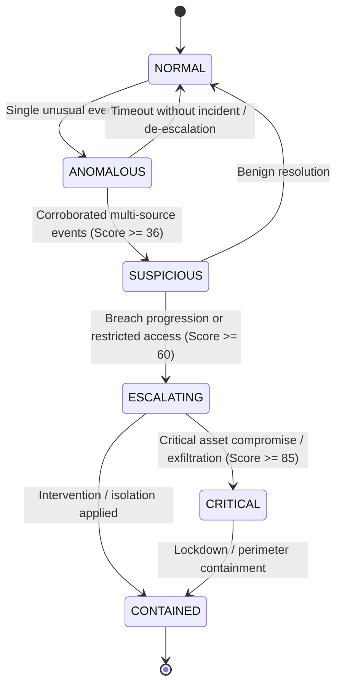

# SENTINEL-X Situation Model

## 1. Overview & Core Philosophy

The fundamental philosophy of SENTINEL-X is **"From Alerts to Situations"**. In traditional security operations, operators are overwhelmed by discrete, uncoordinated alerts from disparate systems (CCTV, network intrusion detection, access control, IoT telemetry). 

SENTINEL-X synthesizes these events into a unified, stateful entity called a **Situation**. A Situation encapsulates:
- The correlated events that triggered and escalated it.
- The contextual entities (people, devices, access points, locations).
- The dynamic topological situation graph (NetworkX).
- The transition history documenting its evolution.
- Real-time risk scoring and risk velocity.
- Future-state trajectory predictions.
- Counterfactual simulations for operator decision support.

---

## 2. Situation Lifecycle & State Machine

SENTINEL-X enforces a strict, deterministic finite state machine (FSM). Arbitrary state jumps are disallowed; every transition is justified by an explicit operational rule, a risk delta, and a triggering event.

### State Definitions

| State | Severity Code | Description | Risk Threshold |
| :--- | :--- | :--- | :--- |
| **NORMAL** | `0` | Baseline environment state. Routine authenticated actions, normal traffic, nominal environmental telemetry. | 0 - 15 |
| **ANOMALOUS** | `1` | Single isolated deviation from baseline (e.g., failed login attempt, temperature variance) without corroborating multi-source evidence. | 16 - 35 |
| **SUSPICIOUS** | `2` | Corroborated anomaly across 2+ events or multi-source indicators (e.g., unusual login followed by badge denial). | 36 - 60 |
| **ESCALATING** | `3` | Active security violation or semantic chain progressing toward high-security zones (e.g., unauthorized presence detected by CCTV after denied badge). | 61 - 85 |
| **CRITICAL** | `4` | Imminent or active breach of critical assets, unauthorized command execution, or multi-zone physical/cyber intrusion. | 86 - 100 |
| **CONTAINED** | `5` | Active threat neutralized or isolated via countermeasure or simulated intervention. | Variable |

### Transition Rules



Every transition generates an immutable `SituationTransition` document.

---

## 3. Data Schema & Models

### Situation Document (`situations` collection)

```json
{
  "_id": "sit-a1b2c3d4e5f6",
  "situation_id": "sit-a1b2c3d4e5f6",
  "title": "Unauthorized Access Progression at Secure Server Room",
  "status": "ESCALATING",
  "risk_score": 75.0,
  "primary_entity_id": "user-8821",
  "primary_location_id": "loc-bld-b-fl2-srv",
  "event_ids": [
    "evt-1001",
    "evt-1002",
    "evt-1003"
  ],
  "created_at": "2026-09-25T08:00:00Z",
  "updated_at": "2026-09-25T08:03:30Z",
  "resolved_at": null,
  "summary": "Coordinated sequence: Badged entry denial followed by biometric camera alert and internal SSH activity."
}
```

### Situation Transition Document (`situation_transitions` collection)

> **CRITICAL DATA RETENTION RULE:**
> To guarantee complete auditability, explainability, and forensic reconstruction, transitions are stored in a dedicated collection without TTL indexes.

```json
{
  "transition_id": "trans-9f8e7d6c5b",
  "situation_id": "sit-a1b2c3d4e5f6",
  "from_state": "SUSPICIOUS",
  "to_state": "ESCALATING",
  "reason": "Unauthorized presence verified via CCTV after badge denial within 120s window.",
  "risk_delta": 25.0,
  "trigger_event_id": "evt-1003",
  "timestamp": "2026-09-25T08:02:15Z"
}
```

---

## 4. Risk Calculation Engine

Risk scores range from `0.0` to `100.0` and are computed deterministically from four dimensions:

1. **Max Event Severity:** Highest single contributing event severity normalized ($0.0 \dots 1.0$).
2. **Event Volume & Multi-Source Diversity:** Extra weighting if events originate from multiple distinct source types (CCTV + NETWORK + ACCESS).
3. **Semantic Chain Complexity:** Chain bonuses applied for matching progression patterns (`ACCESS_DENIED` $\to$ `UNAUTHORIZED_PRESENCE` $\to$ `DATA_EXFILTRATION`).
4. **Target Asset Criticality:** Specific high-value location flags (`Server Room`, `Executive Suite`, `Power Substation`).

$$\text{RiskScore} = \min(100.0, \; (\text{BaseSeverity} \times 40) + (\text{SourceDiversity} \times 20) + (\text{ChainWeight} \times 25) + (\text{AssetCriticality} \times 15))$$

---

## 5. NetworkX Graph Representation

For every active situation, SENTINEL-X maintains a dynamic NetworkX graph. The graph models entities, events, sensors, and locations as nodes, and their operational connections as edges:

- **Node Types:** `Person`, `Device`, `Camera`, `AccessPoint`, `Location`, `Event`, `Situation`
- **Edge Types:** `ACCESSED`, `LOCATED_AT`, `OBSERVED_BY`, `TRIGGERED`, `ASSOCIATED_WITH`

When requested by the frontend (`GET /api/situations/{id}/graph`), the graph is serialized into a clean JSON structure including basic structural metrics (e.g. node degree, density, connected components).
